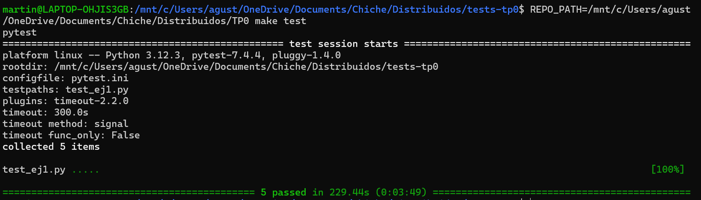
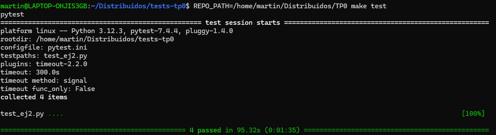
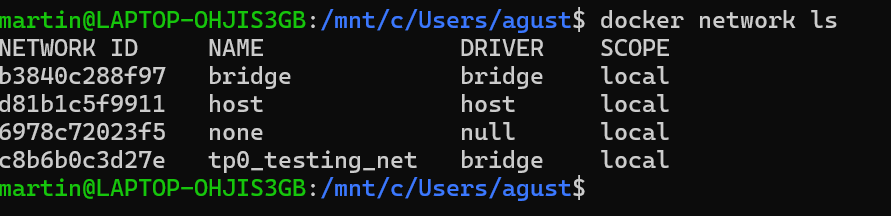
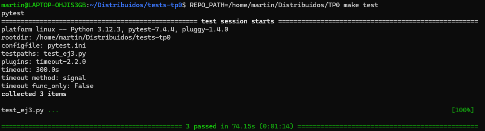
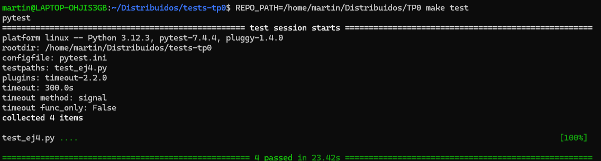
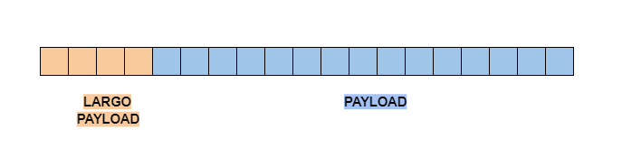
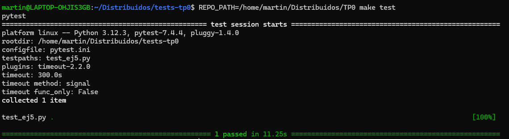
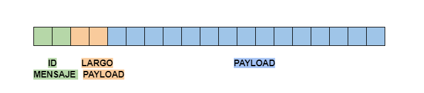
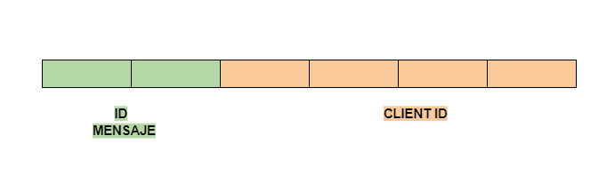

# TP0: Docker + Comunicaciones + Concurrencia

En el presente repositorio se provee un esqueleto básico de cliente/servidor, en donde todas las dependencias del mismo se encuentran encapsuladas en containers. Los alumnos deberán resolver una guía de ejercicios incrementales, teniendo en cuenta las condiciones de entrega descritas al final de este enunciado.

 El cliente (Golang) y el servidor (Python) fueron desarrollados en diferentes lenguajes simplemente para mostrar cómo dos lenguajes de programación pueden convivir en el mismo proyecto con la ayuda de containers, en este caso utilizando [Docker Compose](https://docs.docker.com/compose/).

## Instrucciones de uso
El repositorio cuenta con un **Makefile** que incluye distintos comandos en forma de targets. Los targets se ejecutan mediante la invocación de:  **make \<target\>**. Los target imprescindibles para iniciar y detener el sistema son **docker-compose-up** y **docker-compose-down**, siendo los restantes targets de utilidad para el proceso de depuración.

Los targets disponibles son:

| target  | accion  |
|---|---|
|  `docker-compose-up`  | Inicializa el ambiente de desarrollo. Construye las imágenes del cliente y el servidor, inicializa los recursos a utilizar (volúmenes, redes, etc) e inicia los propios containers. |
| `docker-compose-down`  | Ejecuta `docker-compose stop` para detener los containers asociados al compose y luego  `docker-compose down` para destruir todos los recursos asociados al proyecto que fueron inicializados. Se recomienda ejecutar este comando al finalizar cada ejecución para evitar que el disco de la máquina host se llene de versiones de desarrollo y recursos sin liberar. |
|  `docker-compose-logs` | Permite ver los logs actuales del proyecto. Acompañar con `grep` para lograr ver mensajes de una aplicación específica dentro del compose. |
| `docker-image`  | Construye las imágenes a ser utilizadas tanto en el servidor como en el cliente. Este target es utilizado por **docker-compose-up**, por lo cual se lo puede utilizar para probar nuevos cambios en las imágenes antes de arrancar el proyecto. |
| `build` | Compila la aplicación cliente para ejecución en el _host_ en lugar de en Docker. De este modo la compilación es mucho más veloz, pero requiere contar con todo el entorno de Golang y Python instalados en la máquina _host_. |

### Servidor

Se trata de un "echo server", en donde los mensajes recibidos por el cliente se responden inmediatamente y sin alterar. 

Se ejecutan en bucle las siguientes etapas:

1. Servidor acepta una nueva conexión.
2. Servidor recibe mensaje del cliente y procede a responder el mismo.
3. Servidor desconecta al cliente.
4. Servidor retorna al paso 1.


### Cliente
 se conecta reiteradas veces al servidor y envía mensajes de la siguiente forma:
 
1. Cliente se conecta al servidor.
2. Cliente genera mensaje incremental.
3. Cliente envía mensaje al servidor y espera mensaje de respuesta.
4. Servidor responde al mensaje.
5. Servidor desconecta al cliente.
6. Cliente verifica si aún debe enviar un mensaje y si es así, vuelve al paso 2.

### Ejemplo

Al ejecutar el comando `make docker-compose-up`  y luego  `make docker-compose-logs`, se observan los siguientes logs:

```
client1  | 2024-08-21 22:11:15 INFO     action: config | result: success | client_id: 1 | server_address: server:12345 | loop_amount: 5 | loop_period: 5s | log_level: DEBUG
client1  | 2024-08-21 22:11:15 INFO     action: receive_message | result: success | client_id: 1 | msg: [CLIENT 1] Message N°1
server   | 2024-08-21 22:11:14 DEBUG    action: config | result: success | port: 12345 | listen_backlog: 5 | logging_level: DEBUG
server   | 2024-08-21 22:11:14 INFO     action: accept_connections | result: in_progress
server   | 2024-08-21 22:11:15 INFO     action: accept_connections | result: success | ip: 172.25.125.3
server   | 2024-08-21 22:11:15 INFO     action: receive_message | result: success | ip: 172.25.125.3 | msg: [CLIENT 1] Message N°1
server   | 2024-08-21 22:11:15 INFO     action: accept_connections | result: in_progress
server   | 2024-08-21 22:11:20 INFO     action: accept_connections | result: success | ip: 172.25.125.3
server   | 2024-08-21 22:11:20 INFO     action: receive_message | result: success | ip: 172.25.125.3 | msg: [CLIENT 1] Message N°2
server   | 2024-08-21 22:11:20 INFO     action: accept_connections | result: in_progress
client1  | 2024-08-21 22:11:20 INFO     action: receive_message | result: success | client_id: 1 | msg: [CLIENT 1] Message N°2
server   | 2024-08-21 22:11:25 INFO     action: accept_connections | result: success | ip: 172.25.125.3
server   | 2024-08-21 22:11:25 INFO     action: receive_message | result: success | ip: 172.25.125.3 | msg: [CLIENT 1] Message N°3
client1  | 2024-08-21 22:11:25 INFO     action: receive_message | result: success | client_id: 1 | msg: [CLIENT 1] Message N°3
server   | 2024-08-21 22:11:25 INFO     action: accept_connections | result: in_progress
server   | 2024-08-21 22:11:30 INFO     action: accept_connections | result: success | ip: 172.25.125.3
server   | 2024-08-21 22:11:30 INFO     action: receive_message | result: success | ip: 172.25.125.3 | msg: [CLIENT 1] Message N°4
server   | 2024-08-21 22:11:30 INFO     action: accept_connections | result: in_progress
client1  | 2024-08-21 22:11:30 INFO     action: receive_message | result: success | client_id: 1 | msg: [CLIENT 1] Message N°4
server   | 2024-08-21 22:11:35 INFO     action: accept_connections | result: success | ip: 172.25.125.3
server   | 2024-08-21 22:11:35 INFO     action: receive_message | result: success | ip: 172.25.125.3 | msg: [CLIENT 1] Message N°5
client1  | 2024-08-21 22:11:35 INFO     action: receive_message | result: success | client_id: 1 | msg: [CLIENT 1] Message N°5
server   | 2024-08-21 22:11:35 INFO     action: accept_connections | result: in_progress
client1  | 2024-08-21 22:11:40 INFO     action: loop_finished | result: success | client_id: 1
client1 exited with code 0
```


## Parte 1: Introducción a Docker
En esta primera parte del trabajo práctico se plantean una serie de ejercicios que sirven para introducir las herramientas básicas de Docker que se utilizarán a lo largo de la materia. El entendimiento de las mismas será crucial para el desarrollo de los próximos TPs.

### Ejercicio N°1:
Definir un script de bash `generar-compose.sh` que permita crear una definición de Docker Compose con una cantidad configurable de clientes.  El nombre de los containers deberá seguir el formato propuesto: client1, client2, client3, etc. 

El script deberá ubicarse en la raíz del proyecto y recibirá por parámetro el nombre del archivo de salida y la cantidad de clientes esperados:

`./generar-compose.sh docker-compose-dev.yaml 5`

Considerar que en el contenido del script pueden invocar un subscript de Go o Python:

```
#!/bin/bash
echo "Nombre del archivo de salida: $1"
echo "Cantidad de clientes: $2"
python3 mi-generador.py $1 $2
```

En el archivo de Docker Compose de salida se pueden definir volúmenes, variables de entorno y redes con libertad, pero recordar actualizar este script cuando se modifiquen tales definiciones en los sucesivos ejercicios.

### Ejercicio N°2:
Modificar el cliente y el servidor para lograr que realizar cambios en el archivo de configuración no requiera reconstruír las imágenes de Docker para que los mismos sean efectivos. La configuración a través del archivo correspondiente (`config.ini` y `config.yaml`, dependiendo de la aplicación) debe ser inyectada en el container y persistida por fuera de la imagen (hint: `docker volumes`).


### Ejercicio N°3:
Crear un script de bash `validar-echo-server.sh` que permita verificar el correcto funcionamiento del servidor utilizando el comando `netcat` para interactuar con el mismo. Dado que el servidor es un echo server, se debe enviar un mensaje al servidor y esperar recibir el mismo mensaje enviado.

En caso de que la validación sea exitosa imprimir: `action: test_echo_server | result: success`, de lo contrario imprimir:`action: test_echo_server | result: fail`.

El script deberá ubicarse en la raíz del proyecto. Netcat no debe ser instalado en la máquina _host_ y no se pueden exponer puertos del servidor para realizar la comunicación (hint: `docker network`). `


### Ejercicio N°4:
Modificar servidor y cliente para que ambos sistemas terminen de forma _graceful_ al recibir la signal SIGTERM. Terminar la aplicación de forma _graceful_ implica que todos los _file descriptors_ (entre los que se encuentran archivos, sockets, threads y procesos) deben cerrarse correctamente antes que el thread de la aplicación principal muera. Loguear mensajes en el cierre de cada recurso (hint: Verificar que hace el flag `-t` utilizado en el comando `docker compose down`).

## Parte 2: Repaso de Comunicaciones

Las secciones de repaso del trabajo práctico plantean un caso de uso denominado **Lotería Nacional**. Para la resolución de las mismas deberá utilizarse como base el código fuente provisto en la primera parte, con las modificaciones agregadas en el ejercicio 4.

### Ejercicio N°5:
Modificar la lógica de negocio tanto de los clientes como del servidor para nuestro nuevo caso de uso.

#### Cliente
Emulará a una _agencia de quiniela_ que participa del proyecto. Existen 5 agencias. Deberán recibir como variables de entorno los campos que representan la apuesta de una persona: nombre, apellido, DNI, nacimiento, numero apostado (en adelante 'número'). Ej.: `NOMBRE=Santiago Lionel`, `APELLIDO=Lorca`, `DOCUMENTO=30904465`, `NACIMIENTO=1999-03-17` y `NUMERO=7574` respectivamente.

Los campos deben enviarse al servidor para dejar registro de la apuesta. Al recibir la confirmación del servidor se debe imprimir por log: `action: apuesta_enviada | result: success | dni: ${DNI} | numero: ${NUMERO}`.


#### Servidor
Emulará a la _central de Lotería Nacional_. Deberá recibir los campos de la cada apuesta desde los clientes y almacenar la información mediante la función `store_bet(...)` para control futuro de ganadores. La función `store_bet(...)` es provista por la cátedra y no podrá ser modificada por el alumno.
Al persistir se debe imprimir por log: `action: apuesta_almacenada | result: success | dni: ${DNI} | numero: ${NUMERO}`.

#### Comunicación:
Se deberá implementar un módulo de comunicación entre el cliente y el servidor donde se maneje el envío y la recepción de los paquetes, el cual se espera que contemple:
* Definición de un protocolo para el envío de los mensajes.
* Serialización de los datos.
* Correcta separación de responsabilidades entre modelo de dominio y capa de comunicación.
* Correcto empleo de sockets, incluyendo manejo de errores y evitando los fenómenos conocidos como [_short read y short write_](https://cs61.seas.harvard.edu/site/2018/FileDescriptors/).


### Ejercicio N°6:
Modificar los clientes para que envíen varias apuestas a la vez (modalidad conocida como procesamiento por _chunks_ o _batchs_). 
Los _batchs_ permiten que el cliente registre varias apuestas en una misma consulta, acortando tiempos de transmisión y procesamiento.

La información de cada agencia será simulada por la ingesta de su archivo numerado correspondiente, provisto por la cátedra dentro de `.data/datasets.zip`.
Los archivos deberán ser inyectados en los containers correspondientes y persistido por fuera de la imagen (hint: `docker volumes`), manteniendo la convencion de que el cliente N utilizara el archivo de apuestas `.data/agency-{N}.csv` .

En el servidor, si todas las apuestas del *batch* fueron procesadas correctamente, imprimir por log: `action: apuesta_recibida | result: success | cantidad: ${CANTIDAD_DE_APUESTAS}`. En caso de detectar un error con alguna de las apuestas, debe responder con un código de error a elección e imprimir: `action: apuesta_recibida | result: fail | cantidad: ${CANTIDAD_DE_APUESTAS}`.

La cantidad máxima de apuestas dentro de cada _batch_ debe ser configurable desde config.yaml. Respetar la clave `batch: maxAmount`, pero modificar el valor por defecto de modo tal que los paquetes no excedan los 8kB. 

Por su parte, el servidor deberá responder con éxito solamente si todas las apuestas del _batch_ fueron procesadas correctamente.

### Ejercicio N°7:

Modificar los clientes para que notifiquen al servidor al finalizar con el envío de todas las apuestas y así proceder con el sorteo.
Inmediatamente después de la notificacion, los clientes consultarán la lista de ganadores del sorteo correspondientes a su agencia.
Una vez el cliente obtenga los resultados, deberá imprimir por log: `action: consulta_ganadores | result: success | cant_ganadores: ${CANT}`.

El servidor deberá esperar la notificación de las 5 agencias para considerar que se realizó el sorteo e imprimir por log: `action: sorteo | result: success`.
Luego de este evento, podrá verificar cada apuesta con las funciones `load_bets(...)` y `has_won(...)` y retornar los DNI de los ganadores de la agencia en cuestión. Antes del sorteo no se podrán responder consultas por la lista de ganadores con información parcial.

Las funciones `load_bets(...)` y `has_won(...)` son provistas por la cátedra y no podrán ser modificadas por el alumno.

No es correcto realizar un broadcast de todos los ganadores hacia todas las agencias, se espera que se informen los DNIs ganadores que correspondan a cada una de ellas.

## Parte 3: Repaso de Concurrencia
En este ejercicio es importante considerar los mecanismos de sincronización a utilizar para el correcto funcionamiento de la persistencia.

### Ejercicio N°8:

Modificar el servidor para que permita aceptar conexiones y procesar mensajes en paralelo. En caso de que el alumno implemente el servidor en Python utilizando _multithreading_,  deberán tenerse en cuenta las [limitaciones propias del lenguaje](https://wiki.python.org/moin/GlobalInterpreterLock).

## Condiciones de Entrega
Se espera que los alumnos realicen un _fork_ del presente repositorio para el desarrollo de los ejercicios y que aprovechen el esqueleto provisto tanto (o tan poco) como consideren necesario.

Cada ejercicio deberá resolverse en una rama independiente con nombres siguiendo el formato `ej${Nro de ejercicio}`. Se permite agregar commits en cualquier órden, así como crear una rama a partir de otra, pero al momento de la entrega deberán existir 8 ramas llamadas: ej1, ej2, ..., ej7, ej8.
 (hint: verificar listado de ramas y últimos commits con `git ls-remote`)

Se espera que se redacte una sección del README en donde se indique cómo ejecutar cada ejercicio y se detallen los aspectos más importantes de la solución provista, como ser el protocolo de comunicación implementado (Parte 2) y los mecanismos de sincronización utilizados (Parte 3).

Se proveen [pruebas automáticas](https://github.com/7574-sistemas-distribuidos/tp0-tests) de caja negra. Se exige que la resolución de los ejercicios pase tales pruebas, o en su defecto que las discrepancias sean justificadas y discutidas con los docentes antes del día de la entrega. El incumplimiento de las pruebas es condición de desaprobación, pero su cumplimiento no es suficiente para la aprobación. Respetar las entradas de log planteadas en los ejercicios, pues son las que se chequean en cada uno de los tests.

La corrección personal tendrá en cuenta la calidad del código entregado y casos de error posibles, se manifiesten o no durante la ejecución del trabajo práctico. Se pide a los alumnos leer atentamente y **tener en cuenta** los criterios de corrección informados  [en el campus](https://campusgrado.fi.uba.ar/mod/page/view.php?id=73393).


### Solucion Ejercicio N°1:

Se define un script en `generar-compose.sh` que si no recibe dos parametros, muestra por consola la manera de usarlo y termina. En caso de recibir dos parametros, correspondientes al nombre del archivo yaml a generar y la cantidad de clientes, llama a un script de python `mi-generador.py` que se encarga de crear el archivo yaml.

El programa de Python primero lee los argumentos y luego usa la funcion `get_yaml_content(cantidad_clientes)` que se encarga de devolver el contenido original del yaml y agrega el contenido para cada uno de los clientes a crear con un for loop que agrega el nombre del cliente y el ID de forma dinamica. Luego se llama a la funcion `write_yaml_file(archivo_salida, yaml_content)` que abre el archivo yaml y escribe todo el contenido.

Se puede generar el archivo corriendo el siguiente comando por consola:
`./generar-compose.sh <nombre yaml> <num clientes>`

### Tests:



### Solucion Ejercicio N°2:

En el archivo `docker-compose-dev.yaml`, tanto para el servidor como para el cliente, se agrega un volumen que monta los archivos de configuración respectivos en cada uno de los contenedores. Esto permite que los cambios realizados en los archivos locales se reflejen automáticamente en los contenedores, sin necesidad de reconstruir las imágenes, y que la configuración persista por fuera de la imagen.

Además, se agregan los archivos de configuración al `.dockerignore`, ya que al utilizar volúmenes no es necesario copiarlos al crear las imágenes.

De esta manera, ya no es necesario reconstruir las imágenes cada vez que se modifica la configuración; los cambios se verán reflejados directamente en los contenedores.


```
volumes:
      - ./server/config.ini:/config.ini

volumes:
      - ./client/config.yaml:/config.yaml
```

### Tests




### Solucion Ejercicio N°3:

Como la consigna dice que netcat no puede ser instalado en la maquina host y que no se pueden exponer puertos del servidor, necesariamente hay que levantar un contenedor que se conecte a la red interna de los contenedores `server` y `client`, que sea capaz de ejecutar netcat para interactuar con el server.

Para verificar el nombre de la network se corrió el comando `docker network ls`:



Se puede ver que la red se llama `tp0_testing_net` y a esta misma red hay que conectar al contenedor que va a ser capaz de correr netcat para probar el server. Una vez que los contenedores están conectados a la misma red, pueden comunicarse utilizando la IP del contenedor o los nombres.

Vamos a correr una imagen de [`busybox`](https://hub.docker.com/_/busybox) para crear un contenedor temporal (se corre con el tag `--rm` para que sea eliminado al terminar de ejecutar) a partir de esta imagen que ya tiene instalado netcat listo para ser usado. Se corre utilizando el siguiente comando:
```sh
docker run --rm --network="$NETWORK" busybox sh -c "echo $MESSAGE | nc server 12345"
```

Donde `--network` le dice que se conecte a esa network donde el contenedor del server está conectado así se puede comunicar. Ejecutando `docker run --help` se puede verificar el uso de `--network`:
--network network Connect a container to a network

Con `sh -c` se invoca a la terminal y se le indica que ejecute el comando que viene después de `-c`.
Utilizando netcat se envía el mensaje al server (nombre del contenedor) y se guarda la respuesta.

Luego se verifica la respuesta obtenida desde el server y se imprime el mensaje correspondiente.

#### Instrucciones para correr el script

1. Asegúrate de que el servidor esté corriendo y conectado a la red Docker correspondiente (`tp0_testing_net`):
    ```
    make docker-compose-up
    ```
2. Ejecuta el script desde la terminal:
    ```sh
    sh validar-echo-server.sh
    ```
3. Verificar logs de `"success"` o `"fail"`

### Tests





### Solucion Ejercicio N°4:

Tanto el servidor como el cliente necesitan manejar la señal SIGTERM para poder cerrar todos los recursos correctamente antes de que el thread principal muera.

- Server:
  - Al inicializar el servidor se setea la variable `is_currently_running` = `True`. Esta condicion va a servir para chequear en el main loop del server.
  - Se indica que al recibir la señal se llame a la funcinon `handle_sigterm`
    ```python
    signal.signal(signal.SIGTERM, self._handle_sigterm)
    ```
  - La funcion `handle_sigterm` ejecuta `shutdown_server` que setea la condicion `is_currently_running` a False y cierra el socket del Server.
    ```python
    def shutdown(self):
        try:
            self._is_currently_running = False
            self._server_socket.close()
            logging.info("action: shutdown | result: success | details: server socket closed")
        except Exception as e:
            logging.error(f"action: shutdown | result: fail | error: {e}")
    ```

  - El `accept()` del socket es bloqueante pero tiene un timeout de 1s para que en caso de no recibir conexion entrante en ese tiempo, lanze un error y se verifique la condicion `is_currently_running` del loop while. 
  - Tambien cuando se cierre el socket del server, al intentar hacer `accept()` va a saltar un error que se atrapa en el main loop y al verificarse la variable `is_currently_running`, como va a ser False, se va a salir del while loop
    ```python
    while self._is_currently_running:
            try:
                client_sock = self.__accept_new_connection()
                self.__handle_client_connection(client_sock)
            except (OSError, socket.timeout):
                if not self._is_currently_running:
                    break 
    ```
  - Para los sockets del cliente se espera que desde el cliente se cierre la conexion y al intentar hacer `recv()` o `send()` al socket del cliente lanze un error y salga del `recv()` bloqueante. Como hay una instruccion `finally` al finalizar la funcion ya sea por error o por flujo, se va a cerrar el socket del cliente
    ```python
    finally:
            client_sock.close()
    ```


- Client:
  - Al inicializar el cliente se setea la variable `is_currently_running` = `True`. Esta condicion 
  va a servir para chequear en el main loop del cliente.
  - Se configura un handler para manejar la señal SIGTERM (`setupSigtermHandler`). Se crea un canal (`sigChannel`) con capacidad para un 1 elemento que puede recibir señales del sistema y en caso de recibir una señal SIGTERM se le va a notificar. Se lanza una gorutine que ejecuta la funcion `handleSigterm` y queda bloqueada esperando que llegue una señal por el canal.
    ```go
    func setupSigtermHandler(c *Client) <-chan os.Signal {
        sigChannel := make(chan os.Signal, 1)
        signal.Notify(sigChannel, syscall.SIGTERM)
        go handleSigterm(c, sigChannel)
        return sigChannel
    }
    ```
  - Cuando recibe una señal setea la variable  `is_currently_running` = `False` y cierra la conexion. En el loop principal del cliente, si se estaba intentando leer algo va a lanzar un error porque la conexion fue cerrada y se va a loggear el error y retornar. Si no, la condicion del loop va a detectar que `is_currently_running` = `False` y no va seguir ejecutando el loop.
    ```go
    for msgID := 1; c.is_currently_running && msgID <= c.config.LoopAmount; msgID++ {
      ...
      msg, err := bufio.NewReader(c.conn).ReadString('\n')
      if c.conn != nil{
        c.conn.Close()
        c.conn = nil
      }
      ...
    }
    ``` 

### Tests





### Solucion Ejercicio N°5:

### Protocolo

- Se define el mensaje desde el cliente hacia el servidor sendBet para enviar una apuesta y dejar registro en el servidor



- Los primeros 4 Bytes son fijos y representan el largo del Payload
- El payload es de tamaño variable y son bytes que representan texto (utf-8). Este texto contiene los campos para la apuesta, separados por el caracter <span style="color:blue">"|" </span>:
 - Id del mensaje: Va a ser fijo y esta representado por la cadena de texto `"BET"`
 - Id de la agencia
 - Nombre
 - Apellido
 - Documento
 - Fecha de Nacimiento
 - Numero de apuesta

Por ejemplo, un payload podria ser:

**BET|1|Santiago Lionel|Lorca|30904465|1999-03-17|2201**


1. El cliente (Agencia de quiniela) le manda un mensaje al servidor (Central de Loteria Nacional) en donde el ID del mensaje es `BET`.
2. El servidor lee los primeros 4 bytes y sabe exactamente cuantos bytes mas tiene que leer para el payload. Deserializa el payload y separa los campos que vienen en el orden indicado en la estructura  y separados por el caracter `|`
3. En caso de poder guardar correctamente la apuesta, el servidor le va a mandar un mensaje al cliente en donde los primeros 4 bytes son el largo del payload y un payload variable. Este protocolo define doss posibles mensajes para ese payload:
- "OK": En caso de que se pudo guardar la apuesta correctamente
- "ERROR": En caso de algun error en el servidor para procesar la apuesta


- Los primeros 4 Bytes son fijos y representan el largo del Payload
- Los Bytes del payload representan una cadena de texto (utf-8) que puede ser:
  - "OK"
  - "ERROR"

### Tests





### Solucion Ejercicio N°6:


### Protocolo

### Client

El cliente puede enviarle los siguientes mensajes al servidor:
- SendBets

  


  El mensaje esta compuesto por:
  - 2 Bytes para el ID del mensaje (fijos)
  - 2 Bytes para el largo del payload (fijos)
  - Payload cuyos bytes representan una cadena de texto (utf-8) que esta separada por el caracter <span style="color:red">"&" </span> y tiene los siguientes elementos:
    - Id Cliente (agencia)
    - Id Chunk
    - Apuestas, donde cada apuesta a su vez es una cadena de texto que separa los campos de la apuesta por el caracter <span style="color:blue">"|" </span>:
      - Nombre
      - Apellido
      - Documento
      - Fecha de Nacimiento
      - Numero de apuesta
    
    Ejemplo de un posible payload: 
    1<span style="color:red">&</span>43<span style="color:red">&</span>Santiago Lionel<span style="color:blue">|</span>Lorca<span style="color:blue">|</span>30904465<span style="color:blue">|</span>1999-03-17<span style="color:blue">|</span>2201<span style="color:red">&</span>Joaquin Sebastian<span style="color:blue">|</span>Rivera<span style="color:blue">|</span>21104770<span style="color:blue">|</span>1980-12-11<span style="color:blue">|</span>7737<span style="color:red">&</span>...

- sendFinsih:

  

  El mensaje esta compuesto por:
  - 2 Bytes para el ID del mensaje (fijos)
  - 4 Bytes para el ID de la agencia (fijos)


### Server

El server puede enviarle los siguientes mensajes al Cliente:
  - sendOk
    
    

    El mensaje esta compuesto por:
      - 2 Bytes fijos para el ID del mensaje
      - 4 Bytes fijos para el chunk Id


  - sendFinishACK

    

    El mensaje es igual al que envia el cliente. Esta compuesto por:
      - 2 Bytes fijos para el ID del mensaje
      - 4 Bytes fijos para el ID de la agencia


Se tiene un CSVReader que lee un archivo csv linea por linea. 
Puede leer un chunk, recibiendo la cantiad de apuestas que quiere que tenga ese chunk como maximo y un id para ese chunk:

`func (r *CSVReader) ReadChunk(chunkId string, maxAmount int) (*BetsChunk, error)`
Lee hasta `maxAmount` lineas del archivo CSV y devuelve un struct que tiene las apuestas y el id del chunk:
```go
type BetsChunk struct {
	Bets []*Bet
	Id   string
}
```

1. Se envia el mensaje `sendBets` al servidor con el chunk
2. Se espera por el ack de ese mensaje
3. El servidor recibe el mensaje sendBets, almacena las apuestas y envia el ack para ese mensaje con sendOk que incluye el **chunk Id** del chunk almacenado.
4. Cuando se termina de leer todo el archivo el cliente envia el mensaje `SendFinish` con su ID
5. El servidor responde un ack con un mensaje igual `sendFinish` y el id de la agencia correspondiente.
6. El Cliente recibe el ack y finaliza.