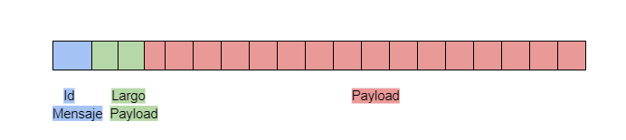

### Ejercicio N°6:
Modificar los clientes para que envíen varias apuestas a la vez (modalidad conocida como procesamiento por _chunks_ o _batchs_). 
Los _batchs_ permiten que el cliente registre varias apuestas en una misma consulta, acortando tiempos de transmisión y procesamiento.

La información de cada agencia será simulada por la ingesta de su archivo numerado correspondiente, provisto por la cátedra dentro de `.data/datasets.zip`.
Los archivos deberán ser inyectados en los containers correspondientes y persistido por fuera de la imagen (hint: `docker volumes`), manteniendo la convencion de que el cliente N utilizara el archivo de apuestas `.data/agency-{N}.csv` .

En el servidor, si todas las apuestas del *batch* fueron procesadas correctamente, imprimir por log: `action: apuesta_recibida | result: success | cantidad: ${CANTIDAD_DE_APUESTAS}`. En caso de detectar un error con alguna de las apuestas, debe responder con un código de error a elección e imprimir: `action: apuesta_recibida | result: fail | cantidad: ${CANTIDAD_DE_APUESTAS}`.

La cantidad máxima de apuestas dentro de cada _batch_ debe ser configurable desde config.yaml. Respetar la clave `batch: maxAmount`, pero modificar el valor por defecto de modo tal que los paquetes no excedan los 8kB. 

Por su parte, el servidor deberá responder con éxito solamente si todas las apuestas del _batch_ fueron procesadas correctamente.


### Solucion Ejercicio N°6:

Se tiene un CSVReader que lee un archivo csv linea por linea. 
Puede leer un chunk, recibiendo la cantiad de apuestas que quiere que tenga ese chunk como maximo y un id para ese chunk:

`func (r *CSVReader) ReadChunk(chunkId string, maxAmount int) (*BetsChunk, error)`
Lee hasta `maxAmount` lineas del archivo CSV y devuelve un struct que tiene las apuestas y el id del chunk:
```
type BetsChunk struct {
	Bets []*Bet
	Id   string
}
```

Si la lista esta vacia quiere decir que ya termino de leer el archivo csv.
Se envia un mensaje de finalizacion con un ID especifico y sin payload para indicar que se enviaron todos los chunks.

### Protocolo

#### ID Mensajes
- CHUNK DE APUESTAS: 12
- FINISH: 13

El protocolo define el paquete enviado de la siguiente manera:
- ID DEL MENSAJE: 1 BYTE (fijo)
- LARGO DEL PAYLOAD: 2 BYTES (fijos)
- PAYLOAD: variable:
    - El payload va a tener lo siguiente:
        - ID cliente
        - ID chunk
        - Apuestas:
            Cada apuesta va a estar compuesta a su vez por:
                - Nombre
                - Apellido
                - Documento
                - Fecha Nacimiento
                - Numero apuesta
            En donde cada campo va a estar separado por el caracter `|`
    En donde cada campo y las apuestas entre si van a estar separadas por el caracter `&`




Ejemplo de payload:

1<span style="color:red">&</span>43<span style="color:red">&</span>Santiago Lionel<span style="color:blue">|</span>Lorca<span style="color:blue">|</span>30904465<span style="color:blue">|</span>1999-03-17<span style="color:blue">|</span>2201<span style="color:red">&</span>Joaquin Sebastian<span style="color:blue">|</span>Rivera<span style="color:blue">|</span>21104770<span style="color:blue">|</span>1980-12-11<span style="color:blue">|</span>7737<span style="color:red">&</span>...

Donde:
- 1: Id cliente
- 43: Id Chunk
