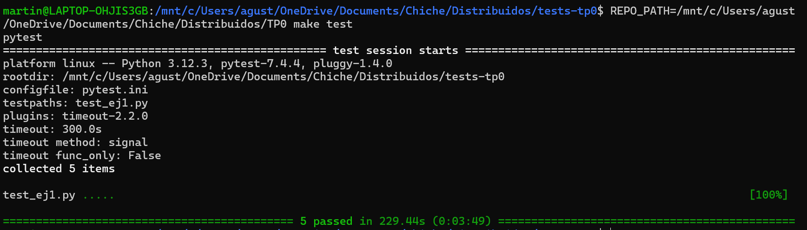

### Ejercicio N°1:
Definir un script de bash `generar-compose.sh` que permita crear una definición de Docker Compose con una cantidad configurable de clientes.  El nombre de los containers deberá seguir el formato propuesto: client1, client2, client3, etc. 

El script deberá ubicarse en la raíz del proyecto y recibirá por parámetro el nombre del archivo de salida y la cantidad de clientes esperados:

`./generar-compose.sh docker-compose-dev.yaml 5`

Considerar que en el contenido del script pueden invocar un subscript de Go o Python:

```
#!/bin/bash
echo "Nombre del archivo de salida: $1"
echo "Cantidad de clientes: $2"
python3 mi-generador.py $1 $2
```

En el archivo de Docker Compose de salida se pueden definir volúmenes, variables de entorno y redes con libertad, pero recordar actualizar este script cuando se modifiquen tales definiciones en los sucesivos ejercicios.


### Solucion Ejercicio N°1:

Se define un script en `generar-compose.sh` que si no recibe dos parametros, muestra por consola la manera de usarlo y termina. En caso de recibir dos parametros, correspondientes al nombre del archivo yaml a generar y la cantidad de clientes, llama a un script de python `mi-generador.py` que se encarga de crear el archivo yaml.

El programa de Python primero lee los argumentos y luego usa la funcion `get_yaml_content(cantidad_clientes)` que se encarga de devolver el contenido original del yaml y agrega el contenido para cada uno de los clientes a crear con un for loop que agrega el nombre del cliente y el ID de forma dinamica. Luego se llama a la funcion `write_yaml_file(archivo_salida, yaml_content)` que abre el archivo yaml y escribe todo el contenido.

Se puede generar el archivo corriendo el siguiente comando por consola:
`./generar-compose.sh <nombre yaml> <num clientes>`

### Tests:

