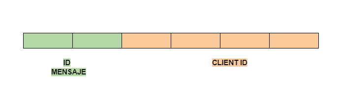
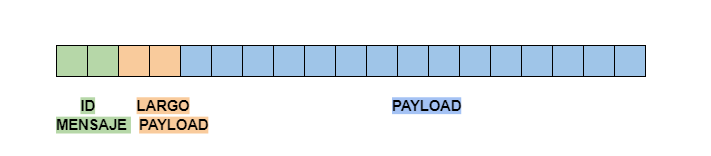

### Ejercicio N°7:
Modificar los clientes para que notifiquen al servidor al finalizar con el envío de todas las apuestas y así proceder con el sorteo.
Inmediatamente después de la notificacion, los clientes consultarán la lista de ganadores del sorteo correspondientes a su agencia.
Una vez el cliente obtenga los resultados, deberá imprimir por log: `action: consulta_ganadores | result: success | cant_ganadores: ${CANT}`.

El servidor deberá esperar la notificación de las 5 agencias para considerar que se realizó el sorteo e imprimir por log: `action: sorteo | result: success`.
Luego de este evento, podrá verificar cada apuesta con las funciones `load_bets(...)` y `has_won(...)` y retornar los DNI de los ganadores de la agencia en cuestión. Antes del sorteo no se podrán responder consultas por la lista de ganadores con información parcial.

Las funciones `load_bets(...)` y `has_won(...)` son provistas por la cátedra y no podrán ser modificadas por el alumno.

No es correcto realizar un broadcast de todos los ganadores hacia todas las agencias, se espera que se informen los DNIs ganadores que correspondan a cada una de ellas.

### Solucion Ejercicio N°7:

En el ejercicio anterior ya fue implementado el mensaje `sendFinish` del cliente al servidor
para indicarle que ya se habia finalizado el envio de todas las apuestas. 

El servidor tiene la informacion de cuantos clientes tiene conectado y al recibir un mensaje del tipo `FINISH` puede ir llevando la cuenta de los clientes listos. Una vez que todos las agencias notifican que terminaron puede proceder con el sorteo

```python
while True:
    message_id = agency_client_sock.receive_message_id()
    if message_id == FINISH_MESSAGE_ID:
        client_id = agency_client_sock.receive_client_id()
        agency_client_sock.send_finish_message(client_id)
        self._agencies_finished += 1
        logging.info(f"action: agencia_finalizo | result: success | total_agencias_finalizadas: {self._agencies_finished}")
        if self._agencies_finished == self._number_of_agencies:
            logging.info("action: sorteo | result: success")
        break
```

### Cliente

- Las agencias ahora pueden enviar un nuevo mensaje
  - sendGetWinners

    
  
  El mensaje esta compuesto por:
    - 2 Bytes fijos para el Id del mensaje
    - 4 Bytes fijos para el ID de la agencia

- Una vez que la agencia recibe el `finishACK` por parte del servidor, puede empezar a pedir por los ganadores usando el mensaje `sendGetWinners`, aunque solo se le respondera una vez que todos los clientes terminaron. Luego de recibir el finishACK, el cliente cierra el socket y va a abrir una nueva conexion por cada intento de pedido de ganadores que haga. Esto es para evitar que el servidor se quede esperando mensajes de un socket inactivo.

  - El cliente intentara enviar cada un tiempo `RETRY_INTERVAL` el mensaje `sendGetWinners` para obtener sus ganadores. 
  - Una vez enviado el mensaje se quedara esperando por la respuesta del servidor. El servidor enviara una respuesta al mensaje `sendGetWinners` que dependiendo del caso el ID va a ser:
    - `NO_WINNERS_MESSAGE_ID`
    - `WINNERS_RESULT_MESSAGE_ID`
  - En caso de que el mensaje sea `NO WINNERS`, ocurre lo siguiente:
    - Se cierra el socket y en el siguiente intento se vuelve a abrir una nueva conexion para preguntar por los resultados
      ```go
      for {
        if err := c.createBetSocket(); err != nil {
          log.Criticalf(
            "action: connect | result: fail | client_id: %v | error: %v",
            c.config.ID,
            err,
          )
          return nil, err
        }

        ...

        if err := c.betSocket.Close(); err != nil {
          log.Errorf("action: close_socket | result: fail | error: %v", err)
        }
      }
      ```
  - En caso de el mensaje sea `WINNERS RESULT`, se deserializa el mensaje y se devuelve la lista de ganadores

### Servidor

El servidor ahora implementa tambien los siguientes mensaje:
  - `send_winners_list`

    

    El mensaje esta compuesto por:
      - 2 Bytes para el Id del mensaje
      - 2 Bytes fijos para el largo del payload
      - Payload dinamico que contiene una cadena de texto (utf-8) que tiene los numeros de documentos de los ganadores separados por el caracter `,`

  - `send_no_winners`

    

    El mensaje esta compuesto por:
      - 2 Bytes fijos con el Id del mensaje

- El servidor al recibir un mensaje del tipo `getWinners` va a poder enviar dos tipos de mensaje dependiedo del caso:
  - Si todos los clientes ya terminaron: Envia mensaje `sendWinnersList`
  - Si falta alguno por terminar: Envia mensaje `sendNoWinners`
  ```python
  elif message_id == GET_WINNERS_MESSAGE_ID:
    if self._agencies_finished == self._number_of_agencies:
        ...
        agency_client_sock.send_winners_list(winners_list)
    else:
        agency_client_sock.send_no_winners()
  ```

